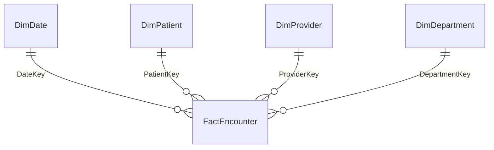

# Building a Power BI Semantic Model with AI — A Health Analytics Tutorial

A hands-on tutorial for building and enhancing a Power BI semantic model using the
**Power BI Modeling MCP Server** with **GitHub Copilot**.

You start with five flat CSV files of synthetic hospital data and finish with a
documented star schema — relationships, measures, a calculation group for time
intelligence, row-level security, and generated documentation — driven almost
entirely by natural-language prompts.

> [!IMPORTANT]
> **All data in this repository is synthetic.** It was generated by
> `scripts/generate_sample_data.py` using a fixed random seed. It contains no real
> patients, providers, facilities, or health records. Any resemblance to a real
> person or organisation is coincidental. Do not use it for clinical, financial,
> or operational decisions.

---

## What you'll build

| Stage | What the agent does |
| --- | --- |
| 1 | Inspects five disconnected tables and recommends a star schema |
| 2 | Creates relationships and marks the date table |
| 3 | Builds eight business measures in a dedicated measures table |
| 4 | Creates a calculation group for time intelligence |
| 5 | Writes descriptions across every table, column, and measure |
| 6 | Adds a row-level security role |
| 7 | Validates the model with DAX queries |
| 8 | Generates Markdown documentation with a relationship diagram |

You start with five flat, disconnected tables and finish with this:



Roughly **45–60 minutes** at a learning pace, or about **15 minutes** as a live
demo.

---

## Why this is interesting

The Power BI Modeling MCP Server exposes semantic-model operations as tools an AI
agent can call — tables, columns, measures, relationships, calculation groups,
security roles, perspectives, translations, and DAX queries. Microsoft's framing
for the wider toolkit is a useful way to think about it:

> Skills tell the agent what to do. Tools let the agent do it.

The payoff is clearest in bulk work. Writing descriptions for every object in a
model, or refactoring measures into a calculation group, is hours of repetitive
effort by hand and a single prompt through the agent.

---

## Documentation

| Guide | Contents |
| --- | --- |
| [01 — Prerequisites](docs/01-prerequisites.md) | Software, licences, permissions, admin settings |
| [02 — Setup](docs/02-setup.md) | Installing the MCP server and skills; loading the data |
| [03 — Build the model](docs/03-build-the-model.md) | The nine prompts, in order, with what to expect |
| [04 — Prompt reference](docs/04-prompt-reference.md) | Every prompt in one copy-paste list |
| [05 — Troubleshooting](docs/05-troubleshooting.md) | Common failures and fixes |

---

## The dataset

Australian hospital operations across four facilities and twelve departments,
covering two financial years (FY2024-25 and FY2025-26).

| File | Rows | Grain |
| --- | --- | --- |
| `data/FactEncounter.csv` | 6,000 | One row per patient encounter |
| `data/DimPatient.csv` | 800 | One row per patient |
| `data/DimProvider.csv` | 60 | One row per clinician |
| `data/DimDepartment.csv` | 12 | One row per department |
| `data/DimDate.csv` | 730 | One row per day |

See [data/README.md](data/README.md) for the full column dictionary.

The data has deliberate signal built in so your measures show something
meaningful rather than noise:

- Emergency admissions have longer wait times, and long waits depress
  satisfaction scores
- Longer stays carry a higher 30-day readmission rate
- Intensive Care encounters skew towards longer stays
- Day Procedures have zero length of stay and lower costs — except in Intensive
  Care, where a two-day minimum applies

To regenerate the data (optional — the CSVs are committed):

```bash
python scripts/generate_sample_data.py
```

The script uses `random.seed(42)`, so output is reproducible.

---

## Quick start

You'll need **Power BI Desktop**, **VS Code**, and the **GitHub Copilot CLI** —
the CLI installs the skills bundle, VS Code runs the session.

```bash
# 1. Install the skills bundle (requires GitHub Copilot CLI and Node.js 18+)
copilot plugin marketplace add microsoft/skills-for-fabric
copilot plugin install powerbi-authoring@fabric-collection
```

```
# 2. Confirm the skills loaded
/skills
```

3. In VS Code, install the **GitHub Copilot Chat** and **Power BI Modeling MCP**
   extensions, reload, and switch Copilot Chat to **Agent mode**
4. Load the five CSVs into a new Power BI Desktop file, save as PBIP
5. Point the agent at it:

```
Connect to 'HealthAnalytics' in Power BI Desktop
```

Then work through [03 — Build the model](docs/03-build-the-model.md).

Full instructions in [02 — Setup](docs/02-setup.md).

---

## Before you start

- **Back up your model.** Microsoft's own guidance: the underlying LLM "may
  produce unexpected or inaccurate results, which could lead to unintended
  changes."
- **Commit a baseline to Git** before letting the agent write, so you can revert.
- **Consider `--readonly` for your first pass** to watch what the agent proposes
  before allowing writes.

---

## Scope and limits

- The Modeling MCP Server performs **modelling operations only**. It cannot modify
  report pages or diagram layouts.
- Everything here runs locally against Power BI Desktop — no Fabric items, no
  capacity, and no tenant settings.

---

## Reference

- [Power BI Modeling MCP Server](https://github.com/microsoft/powerbi-modeling-mcp)
- [Power BI Agentic overview](https://learn.microsoft.com/power-bi/developer/agentic/power-bi-agentic-overview)
- [Power BI MCP server documentation](https://learn.microsoft.com/power-bi/developer/mcp/)
- [Skills for Fabric](https://github.com/microsoft/skills-for-fabric)

---

## Licence

Tutorial content and sample data in this repository are released under the
[MIT Licence](LICENSE).

The Power BI Modeling MCP Server (currently in preview) is governed by its own
licence terms — see the
[Microsoft repository](https://github.com/microsoft/powerbi-modeling-mcp).
