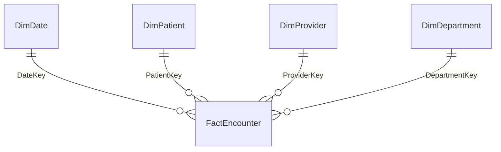

# 03 — Build the model

**Where you are:** tooling installed, five flat tables loaded into Power BI
Desktop. **What you'll have at the end:** a documented star schema with measures,
time intelligence, row-level security and generated documentation.

Nine prompts, in order. Each section gives you the prompt, what the agent should
do with it, and what to check before moving on.

Work through them sequentially — later prompts depend on earlier ones.

| # | Prompt | Result |
| --- | --- | --- |
| 1 | Connect | Agent attached to your Desktop model |
| 2 | Inspect and recommend | A proposed star schema, nothing written yet |
| 3 | Build the star schema | Four relationships, `DimDate` marked as the date table |
| 4 | Create the measures | Eight measures in a `_Measures` table |
| 5 | Time intelligence | A `Time Intelligence` calculation group with five items |
| 6 | Bulk documentation | Descriptions across every table, column and measure |
| 7 | Row-level security | A `State Manager` role filtering by state |
| 8 | Validate with DAX | A query run against the model, with results |
| 9 | Generate documentation | A Markdown file with a relationship diagram |

> [!TIP]
> Agent phrasing varies between runs. If a result differs from what's described
> here, that's normal. What matters is whether the *outcome* matches — check the
> verification step rather than the wording.

---

## Prompt 1 — Connect

```
Connect to 'HealthAnalytics' in Power BI Desktop
```

**What happens:** the agent locates the running Power BI Desktop instance and
connects to its Analysis Services engine. You'll see an elicitation prompt asking
for approval before the first query.

**Verify:** the agent confirms the connection and can name the model.

---

## Prompt 2 — Let it inspect

```
Describe the tables and columns in this model, and tell me what kind of
star schema you'd recommend based on what you find.
```

**What happens:** the agent reads the model metadata and proposes a design. It
should identify `FactEncounter` as the fact table and the four `Dim*` tables as
dimensions, and spot the key columns.

**Why this prompt matters:** it demonstrates the agent working from the actual
model rather than guessing, and it gives you a checkpoint before any writes.

**Verify:** the recommendation names the right fact table and the right join keys.
If it doesn't, stop and check your data loaded correctly.

---

## Prompt 3 — Build the star schema

```
Create relationships for a star schema: FactEncounter is the fact table,
joined to DimPatient on PatientKey, DimProvider on ProviderKey,
DimDepartment on DepartmentKey, and DimDate on DateKey.
Set all as single-direction, one-to-many from dimension to fact.
Mark DimDate as the date table using the Date column.
```

**What happens:** four relationships created, and `DimDate` marked as the date
table. You'll see the elicitation prompt for the first modification.

**What you're aiming for:**



Four dimensions, one fact table, every relationship one-to-many from the dimension
to the fact and filtering in a single direction.

**Verify:** open Model view in Power BI Desktop. You should see a clean star —
four dimensions radiating from one fact table, all with single-direction arrows
pointing towards the fact.

> [!NOTE]
> Marking the date table is what makes time intelligence work later. Don't skip
> it.

---

## Prompt 4 — Create the measures

```
Create these measures in a new table called '_Measures', formatted appropriately:
Total Encounters, Total Cost, Average Length of Stay, 30-Day Readmission Rate
as a percentage, Average Wait Time, Average Satisfaction Score,
Cost Recovery Rate as reimbursed over total cost, and Emergency Encounters.
```

**What happens:** the agent creates a dedicated measures table and eight measures
with appropriate DAX and format strings.

**Expected DAX shapes** (yours may vary slightly — that's fine if the logic holds):

| Measure | Approach |
| --- | --- |
| Total Encounters | `COUNTROWS(FactEncounter)` |
| Total Cost | `SUM(FactEncounter[TotalCost])` |
| Average Length of Stay | `AVERAGE(FactEncounter[LengthOfStayDays])` |
| 30-Day Readmission Rate | Count where `ReadmittedWithin30Days = "Yes"` divided by total |
| Average Wait Time | `AVERAGE(FactEncounter[WaitTimeMinutes])` |
| Average Satisfaction Score | `AVERAGE(FactEncounter[SatisfactionScore])` |
| Cost Recovery Rate | `DIVIDE(SUM(ReimbursedAmount), SUM(TotalCost))` |
| Emergency Encounters | Count where `AdmissionType = "Emergency"` |

**Verify:** drop `Total Encounters` into a card visual. It should show 6,000.

---

## Prompt 5 — Time intelligence via calculation group

```
Create a calculation group called 'Time Intelligence' with items for
Current, Prior Year, Year-over-Year change, Year-over-Year percent,
and Financial Year to Date, using the DimDate table.
```

**What happens:** the agent creates a calculation group with five calculation
items. Each one wraps `SELECTEDMEASURE()` in the relevant time-intelligence
pattern.

**Why this is the standout step:** a calculation group applies to *every* measure
in the model. Five items across eight measures is forty combinations from one
object — the equivalent hand-written approach is forty separate measures.

**Verify:** build a matrix with a measure in Values and the calculation group in
Columns. You should see the same measure repeated across five time variants:

| | Current | Prior Year | YoY | YoY % | FYTD |
| --- | --- | --- | --- | --- | --- |
| **Total Cost** | 12,345,678 | 11,987,654 | 358,024 | 3.0% | 6,172,839 |

One measure down, five calculation items across. Swap the measure and the same
five variants apply — that's the whole point of a calculation group. The figures
above are illustrative; what matters is the shape.

> [!TIP]
> The dataset uses the Australian financial year (July–June), and `DimDate` has a
> `FinancialYear` column. Financial Year to Date should respect that, not the
> calendar year.

---

## Prompt 6 — Bulk documentation

```
Add descriptions to every table, column, and measure explaining its purpose
in business-friendly language, and for measures explain the DAX logic in plain terms.
```

**What happens:** the agent writes descriptions across every object in the model —
five tables, roughly forty columns, and eight measures.

**Why it's worth demoing:** this is the clearest illustration of bulk operations.
Doing it by hand is an hour of tedious work nobody ever gets around to. It also
improves downstream Copilot quality, since descriptions are part of the metadata
an AI reads.

**Verify:** hover over any field in the Data pane — a tooltip should appear.

---

## Prompt 7 — Row-level security

```
Create a security role called 'State Manager' that filters DimDepartment
to a single state, and show me how to test it.
```

**What happens:** the agent creates a security role with a DAX filter on
`DimDepartment[State]`, and explains how to validate it.

**Verify:** in Power BI Desktop, **Modeling → View as** and select the role. Your
visuals should filter to the chosen state.

---

## Prompt 8 — Validate with DAX

```
Write and run a DAX query showing readmission rate and average length of stay
by service line, sorted by readmission rate descending.
```

**What happens:** the agent writes a DAX query, executes it against the model, and
returns results in the chat.

**Verify:** your results should match these figures, computed directly from the
sample data:

| Service Line | Encounters | Readmission % | Avg LOS |
| --- | --- | --- | --- |
| Acute Care | 1,017 | 8.2% | 2.91 |
| Community Services | 477 | 8.2% | 2.47 |
| Women's Health | 990 | 8.0% | 2.87 |
| Medical Specialties | 2,026 | 6.9% | 2.76 |
| Sub-Acute Care | 510 | 5.7% | 2.62 |
| Surgical Services | 980 | 5.5% | 2.54 |

If your numbers match, the model is wired correctly end to end.

> [!NOTE]
> Don't read too much into the trend here. The readmission signal in the sample
> data is seeded at **encounter** grain — stays longer than five days readmit at
> 15.2%, against 6.0% otherwise. Averaging up to six service lines mutes it,
> because most encounters are short: average length of stay spans just 2.47 to
> 2.91 days across the whole table, and Community Services posts the equal-highest
> readmission rate on the second-shortest stay.
>
> To see the effect clearly, bucket `LengthOfStayDays` above and below five days
> instead — that split gives you 702 encounters against 5,298.

---

## Prompt 9 — Generate documentation

```
Generate a Markdown document with complete documentation for this semantic model.
Use a mermaid diagram for the relationships, document each measure with its DAX
and business logic, and document the row-level security filters.
```

**What happens:** the agent produces a Markdown file documenting the model,
including a mermaid diagram of the star schema.

**Verify:** the mermaid diagram should render on GitHub, showing the fact table
joined to four dimensions.

**A good closing note for a demo:** you began with five disconnected CSVs and
finished with a documented, secured, time-intelligent model — and the
documentation regenerates any time the model changes.

---

Prev: [02 — Setup](02-setup.md) · Next: [04 — Prompt reference](04-prompt-reference.md)
